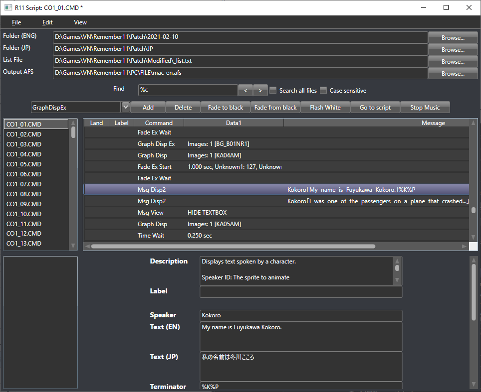

# Remember11 Script Editor
Edit and repack scenario files for the PC version of [Remember11: The Age of Infinity](https://vndb.org/v13).

## Installation
Precompiled binaries can be found in [Releases](https://github.com/arsym-dev/Remember11-Script-Editor/releases). The release also contains the English CMD files and list.txt.

## Setup
1. Extract English CMD files from `<Remember11>/FILE/mac-en.afs`. This can be done with [Kid Tools GUI](https://ayuanx.wordpress.com/2008/07/17/ktg/) or [AnimEd](https://github.com/niksaak/ae) ([binaries](http://wks.arai-kibou.ru/ae.php?p=dl))
2. (Optional) Extract Japanese CMD files from `<Remember11>/FILE/mac.afs`.
3. Using AnimEd, create a list.txt from the AFS archive. This ensures that we repack the files correctly.
3. Run `R11_Script_Editor.exe` and make sure `View > Folders` is checked.
4. Set the fields to the following:
    - `Folder (ENG)` is the folder from step 1
    - `Folder (JP)` is the folder in step 2
    - `List File` is the text file created in step 3

## Usage
- Once you've set up the program, a list of files will now appear on the left. You may click on them and edit them.
- Once you're done editing a script, save by pressing `File > Save current file` or Ctrl+S.
- When you'd like to repack the files, press `File > Export mac-en.afs` or Ctrl+E.
- To preview the changes without having to close and reopen the game, simply open the backlog in the game then jump back a single line.

## Features
- Add, remove and change any command anywhere in the script
- Search the script for text in English or Japanese
- Quickly translate the text using Google, Bing, or DeepL.